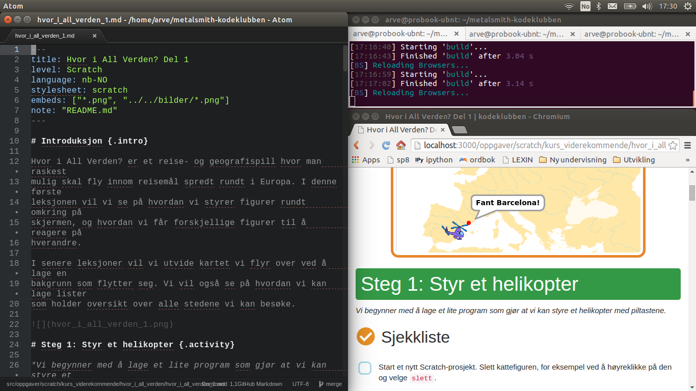

[](https://travis-ci.org/arve0/codeclub_lesson_builder)

# codeclub_lesson_builder
This project builds codeclub exercises from markdown to styled webpages. A file
watcher builds upon changes and refreshes the browser. Watching is done through
[gulp](//gulpjs.com) and build are done with [metalsmith](//metalsmith.io).

Here is a screenshot with exmaple of workflow:


## Development
You will need [node](//nodejs.org) and
[git](//help.github.com/articles/set-up-git/) for using this software.

*codeclub_lesson_builder* should be cloned into a lesson project where markdown
lessons are in a `src` folder. This simplifies setup for contributors, as
*codeclub_lesson_builder* can be included as a git submodule and cloned
recursively. Cloning lesson repo for contributors (instead of this repo with
lessons as submodule) will make pull request to the lesson repo a bit less
complex. The steps below assumes this setup, and are only needed upon first
time inclusion in the lesson repo. Steps for setting up lesson repo with
local building should be similar to this. Look at
[this repo](https://github.com/arve0/example_lessons) for an example of setup.

**Clone repository**
```
git clone https://github.com/arve0/codeclub_lesson_builder
```

**Installing requirements**
```
cd codeclub_lesson_builder
npm install
cp utils/gulp utils/gulp.bat ..
cd ..
```

**Run server *nix**
```
./gulp
```

**Run server windows**
```
gulp.bat
```

### Note Ubuntu users!
nodejs is not installed as *node*, and this causes problems for some packages.
To fix this, link *node* to *nodejs* like so **BEFORE** installing packages
through npm:
```
sudo ln -s /usr/bin/nodejs /usr/local/bin/node
```

### Note - Maximum number of open files
Gulp and metalsmith read files in parallel, which might cause trouble for some
users. If number of open files exceeds operating system limits, one will get
an *EMFILE* error code. Description for increasing number of allowed open files:

- [Linux](http://unix.stackexchange.com/questions/85457/how-to-circumvent-too-many-open-files-in-debian#answers)
- [Mac](http://superuser.com/questions/302754/increase-the-maximum-number-of-open-file-descriptors-in-snow-leopard#answers)
- Windows: Not affected. Report if you're experiencing any trouble.

### Trouble
[](https://gitter.im/arve0/codeclub_lesson_builder)

Having problems? Come and [chat with us on gitter](https://gitter.im/arve0/codeclub_lesson_builder).


## Specification
You could read about the format in [FORMAT.md](FORMAT.md).

### Features
- [x] Convert markdown to styled HTML
- [x] Convert markdown to styled PDF
- [x] Link-checker
- [x] Automatic build with github webhooks
- [x] Create zip-archives of all lessons
- [x] Style scratch code
- [x] Specify your own header and footer in [templates](templates)
- [x] Watch files and re-render lesson upon changes (live-reload in browser)
- [x] Create playlists and hide lessons from index
- [ ] Lesson tags
- [ ] Sortable index with search
- [ ] Support for several languages
- [ ] Use material from other webpages with `external`-tag

### gulp tasks
You can run all tasks with `./gulp taskname` when in the lesson repo, or with `gulp taskname` in
*codeclub_lesson_builder*-folder if you have installed gulp [globally](https://docs.npmjs.com/cli/install).

**list of gulp tasks**
- `archive` will create zip files of [collections](https://github.com/arve0/codeclub_lesson_builder/blob/master/config.js#L19)
- `assets` copies assets to `build/assets`
- `build` builds all markdown files (except README.md) to html and copy files which are in lesson-folders
- `clean` delete all files in `build`
- `css` will process less files, add asset-css, autoprefix, minify and concat to `style.min.css`
- `js` uglify, add already uglified asset-js and concat to `script.min.js`
- `pdf` will create PDFs of all htmls in build folder
- `server` will start a local web-server and open your browser with the index
- `default` start the `server`-task and reload browser upon file changes (runs when gulp recieves no arguments)
- `dist` does a clean then a complete build
- `links` runs a local server and check all links on all pages
- `prodlinks` check links on production page, set start in [config.js](config.js): `productionCrawlStart`
- `github` start webhook server which listens for pushes to repo and starts build
